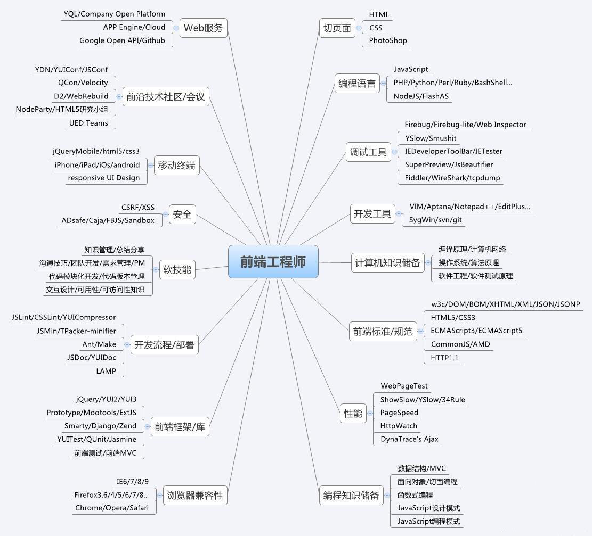

[TOC]
# Markdown语法

Markdown的语法集合比较小，支持嵌套HTML语法，也支持些CSS。

## 目录与标题

# 这是一级标题
## 这是二级标题
### 这是三级标题
#### 这是四级标题
##### 这是五级标题
###### 这是六级标题
```
[TOC] 全文内容的目录结构
# 这是一级标题
## 这是二级标题
### 这是三级标题
#### 这是四级标题
##### 这是五级标题
###### 这是六级标题
```

## 文本段落

### 转义符 \

Markdown 可以利用反斜杠 \ 来插入一些在语法中有其它意义的符号
例如：想要用星号加在文字旁边的方式来做出强调效果，但不使字体倾斜，可以在星号的前面加上反斜杠：
\*literal asterisks\*
`\*literal asterisks\*`

### 斜体加粗、背景高亮、分割线

*斜体*
**加粗**
***斜体加粗***
~~删除线~~
==背景高亮==
++下划线++
```
*斜体*
**加粗**
***斜体加粗***
~~删除线~~
==背景高亮==
++下划线++
```

分割线

---
----
***
*****

```
分割线:三个或更多的 - 或 * 均可，也可以在 - 或 * 中间插入空格。
---
----
***
*****
```

### 文字方向

<center>行中心对齐</center>
<p align="left">行左对齐</p>
<p align="right">行右对齐</p>
```
<center>行中心对齐</center>
<p align="left">行左对齐</p>
<p align="right">行右对齐</p>
```

### 占位符

多个回车换行，仅显示一个;
多个空格，仅显示一个，显示更多的空间，需要用到占位符，一个空格与一个\&nbsp;空间一样大.

|&emsp;或&#8195; //全角1
|&ensp;或&#8194; //半角2
|&nbsp;或&#160;  //半角之半角3
| 或&#160;  //半角之半角4
|是参考线
```
|&emsp;或&#8195; //全角1
|&ensp;或&#8194; //半角2
|&nbsp;或&#160;  //半角之半角3
| 或&#160;  //半角之半角4
|是参考线
```

## 引用

>这是引用的内容
>>这是引用的内容
>>>>这是引用的内容
```
>这是引用的内容
>>这是引用的内容
>>>>这是引用的内容
```

## 复选框

- [ ] 未选中
- [x] 选中
```
- [ ] 未选中
- [x] 选中
```

## 图片




```

```

图片alt是加载图片失败时的文字说明。
图片title是图片的标题，当鼠标移到图片上时显示的内容。title可加可不加

## 超链接

###  1.行内式

[简书](http://jianshu.com "简书")
[简书](http://jianshu.com)
<a href="https://www.jianshu.com/u/1f5ac0cf6a8b" target="_blank" title="a标签">a标签</a>

```
[text](url "title")

也可以用html语言的a标签代替。
<a href="超链接地址" target="_blank">超链接名</a>
```

### 2. 参考式

参考式超链接一般用在学术论文上面，或者另一种情况，如果某一个链接在文章中多处使用，那么使用引用的方式创建链接便于统一管理。

[link1][link1]、[link2][link2]、[[link3][link3]等资讯网站中，[link1][link1]流量最大，更新速度也最快。

```
[link1][link1]、[link2][link2]、[[link3][link3]等资讯网站中，[link1][link1]流量最大，更新速度也最快。

[显示内容][声明值]
插入文本中的内容

[声明值]: 参考链接link "title"
如：[link1]:http://www.biying.com "只需修改这一处即可完成所有引用link1的改变"
声明的链接，一般写在文档末尾，方便统一修改
```

[link1]:http://www.link1.com "只需修改这一处即可完成所有引用link1的改变"
[link2]:http://www.link2.com "link2 title"
[link3]:http://www.link3.com

### 3. 标题跳转（锚点）

使用锚点，可以跳转到文档中的指定位置。与在目录中点击章节进行跳转一样，还有下一节的注脚，这些根本上都是用锚点来实现的，只支持在标题后插入锚点，其它地方无效。

[跳转至>>目录标题](#目录与标题)
[跳转至>>引用](#引用)
<a  href="#目录与标题" title="title">跳转至>>目录标题</a>

```
[显示内容](#标题名称) 此锚点指向的是#后'title'的位置
#后标题名称，无论是几级标题都只用一个#，无所写标题名称时，不跳转
```

## 注脚

使用Markdown[^1]可以提高书写文档的效率，也可以转换成HTML[^html]。

[^1]:Markdown是一种纯文本标记语言
[^html]:即HyperText Markup Language 超文本标记语言
```
使用Markdown[^1]可以提高书写文档的效率，也可以转换成HTML[^html]。

[^1]:Markdown是一种纯文本标记语言
[^html]:即HyperText Markup Language 超文本标记语言
```
**注意**：经测试注脚与注脚之间必须空一行，不然会失效。成功后会发现，即使你没有把脚注写在文末，经Markdown转换后，也会显示在文档的最后面；点击注脚跳转到末尾脚注处，脚注后方的回车符可以跳转回加注的地方。

## 注释

注释内容不会在文档上显示

[//]: # (哈哈我是最强注释，不会在浏览器中显示。)
[^_^]: # (哈哈我是最萌注释，不会在浏览器中显示。)
[//]: <> (哈哈我是注释，不会在浏览器中显示。)
[comment]: <> (哈哈我是注释，不会在浏览器中显示。)

```
[//]: # (哈哈我是最强注释，不会在浏览器中显示。)
[^_^]: # (哈哈我是最萌注释，不会在浏览器中显示。)
[//]: <> (哈哈我是注释，不会在浏览器中显示。)
[comment]: <> (哈哈我是注释，不会在浏览器中显示。)
```

## 列表

### 无序、有序列表

- 无序列表
+ 无序列表
* 无序列表

1. 有序列表
3. 有序列表
5. 有序列表
````
- 无序列表
+ 无序列表
* 无序列表

1. 有序列表
2. 有序列表
3. 有序列表
无序列表用 - + * 任何一种都可以，有序列表是数字加点.
````
**注意**：- + * . 符号跟内容之间要有空格

### 列表嵌套

- 一级无序列表内容
  1. 二级有序列表内容
  3. 二级有序列表内容
  5. 二级有序列表内容
- 二级无序列表内容
  + 二级无序列表内容
    1. 三级
    3. 三级
  + 二级无序列表内容
  
```
- 一级无序列表内容
    1. 二级有序列表内容
    2. 二级有序列表内容
    3. 二级有序列表内容
- 二级无序列表内容
  - 二级无序列表内容
  - 二级无序列表内容
```
**注意**：上一级和下一级之间敲一个Tab或两个空格即可

### 定义型列表(原生语法不支持)

Markdown1
:   轻量级文本标记语言（一个Tab）

Markdown2
: 轻量级文本标记语言（一个空格）

```
名词
: 解释
:(Tab或空格)解释
一行写上定义，紧跟一行写上解释。:一个Tab或空格 + 解释
```
**注意**：定义型列表上下两侧必须保持是回车符，即必须是空的行

## 表格

1. 
    表头111|表头222|表头333
    ---|:--:|---:
    内容|内容|内容
    内容|内容|内容
2. 
    姓名name|技能skill|排行ranking
    -|:-:|--:
    刘备|哭|大哥
    关羽|打|二哥
    张飞|骂|三弟
3. 
    |第一列|第二列|第三列|
    |-|:-:|-:|
    |左|中|右|
4. 
    笑脸 :|
    :|

```
默认为左对齐
- 左对齐， :-: 中心对齐，-: 右对齐
1. 
    表头111|表头222|表头333
    ---|:--:|---:
    内容|内容|内容
    内容|内容|内容
2. 
    姓名name|技能skill|排行ranking
    -|:-:|--:
    刘备|哭|大哥
    关羽|打|二哥
    张飞|骂|三弟
3. 
    |第一列|第二列|第三列|
    |-|:-:|-:|
    |左|中|右|
4. 
    笑脸 :|
    :|
```
不管是哪种方式，第一行为表头，第二行分隔表头和主体部分，还可以为不同的列指定对齐方向，第三行开始每一行为一个表格行，列与列之间用管道符 | 隔开（原生语法两边都要用管道符 | 包起来）。

## 代码

### 单行代码

`单行代码`
```
`单行代码`

代码两边分别用一个反引号包起来
`是Esc下方的 ~ 键，不是单引号
```
### 代码块

    代码块两侧分别用三个反引号包起来，且两边的反引号单独占一行
    ```
    代码块1
    代码块2
    ```
    代码块也可以使用四个空格或是一个Tab表示

**注意**：代码块中使用6个反引号时，只要用Tab或空格表示代码块就能错开语法识别的冲突了

### Html原始代码

在代码区块里面， & 、 < 和 > 会自动转成HTML实体，不用担心特殊字符的问题，这使得用Markdown展示范例用的Html原始代码非常简单。

```
<div class="footer">
   © 2004 Foo Corporation
</div>
<table>
   <tr>
      <th rowspan="2">值班人员</th>
      <th>星期一</th>
      <th>星期二</th>
      <th>星期三</th>
   </tr>
   <tr>
      <td>李强</td>
      <td>张明</td>
      <td>王平</td>
   </tr>
</table>
```

## LaText公式

质能守恒方程可以用一个很简洁的方程式 $E = m c^2$来表达。 
上下标: $x_i^2$
分式: $\frac {a+c+1}{b+c+2},\frac ab$
$$ E = m c^2 $$
```
质能守恒方程可以用一个很简洁的方程式 $E = m c^2$来表达。 
上下标: $x_i^2$
分式: $\frac {a+c+1}{b+c+2},\frac ab$
$$ E = m c^2 $$

行内公式 $内容$
行间公式 $$内容$$
上标和下标分别使用 ^ 与 _ 如: x_i^2
分式 \frac ab，\frac {a+c+1}{b+c+2}
不是单个字符，请使用{..}来分组

```
## 流程图

```flow
st=>start: 开始
op=>operation: My Operation
cond=>condition: Yes or No?
e=>end
st->op->cond
cond(yes)->e
cond(no)->op
```

类型:
start 开始标签
end 结束标签
operation 操作描述
subroutine 子程序
condition 变量流向，no和yes两种流向
inputoutput 输出

## UML图

```flow
st=>start: Start|past:>http://www.google.com[blank]
e=>end: End:>http://www.google.com
op1=>operation: My Operation|past
op2=>operation: Stuff|current
sub1=>subroutine: My Subroutine|invalid
cond=>condition: Yes 
or No?|approved:>http://www.baidu.com
c2=>condition: Good idea|rejected
io=>inputoutput: catch something...|request

st->op1(right)->cond
cond(yes, right)->c2
cond(no)->sub1(left)->op1
c2(yes)->io->e
c2(no)->op2->e
```

    ```flow
    st=>start: Start|past:>http://www.google.com[blank]
    e=>end: End:>http://www.google.com
    op1=>operation: My Operation|past
    op2=>operation: Stuff|current
    sub1=>subroutine: My Subroutine|invalid
    cond=>condition: Yes 
    or No?|approved:>http://www.baidu.com
    c2=>condition: Good idea|rejected
    io=>inputoutput: catch something...|request

    st->op1(right)->cond
    cond(yes, right)->c2
    cond(no)->sub1(left)->op1
    c2(yes)->io->e
    c2(no)->op2->e
    ```